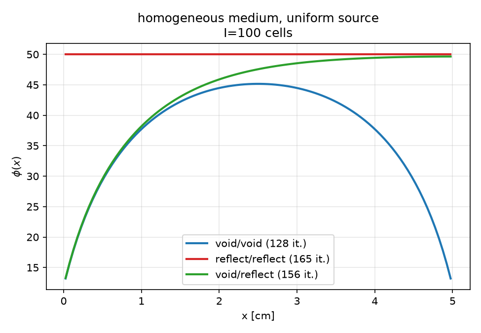
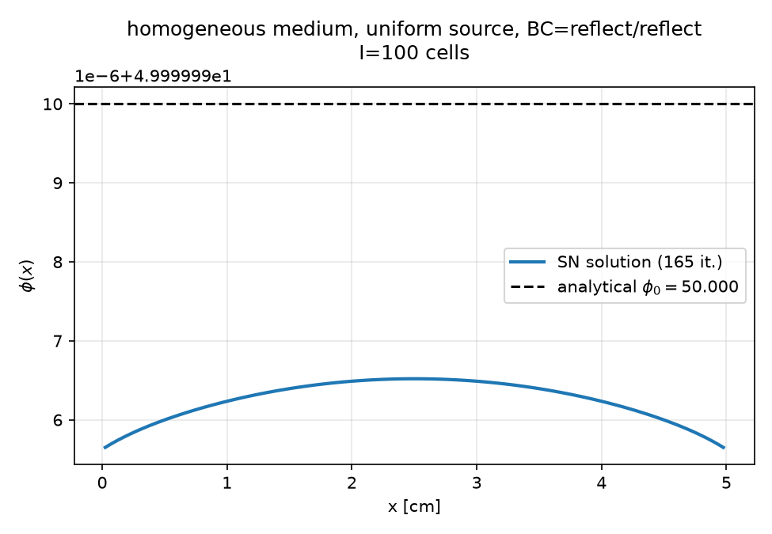
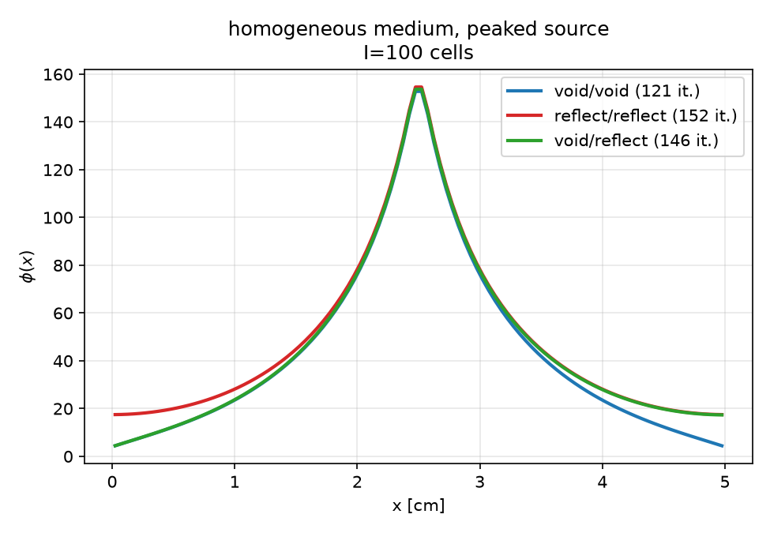
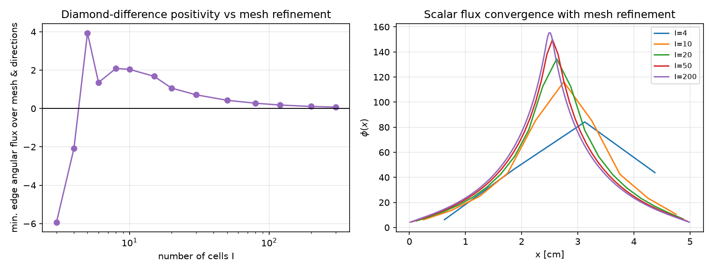
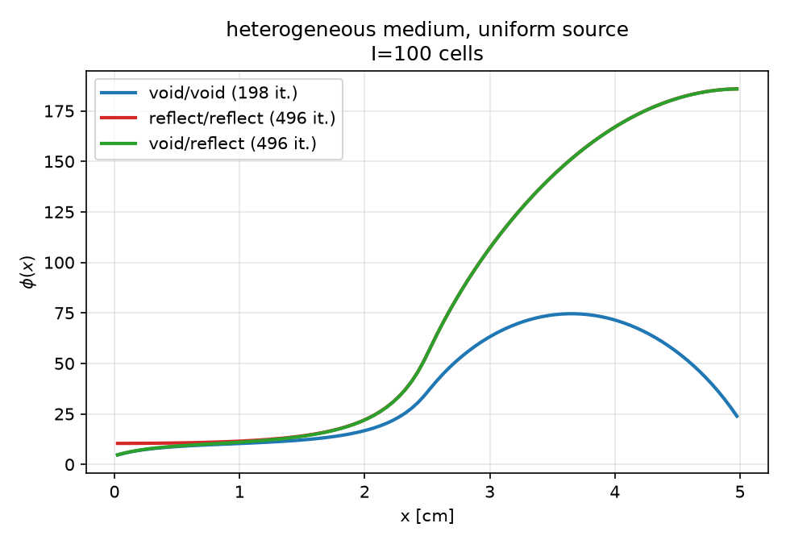
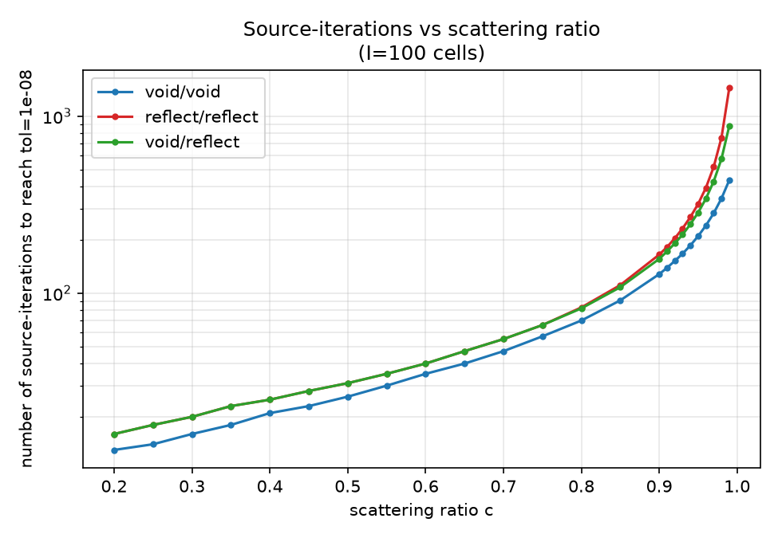
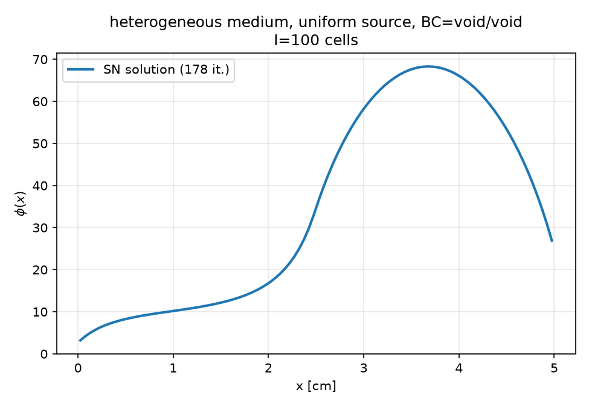
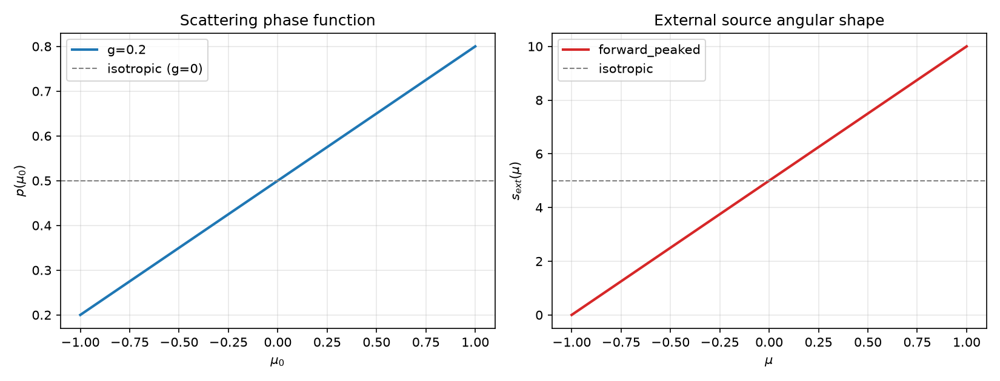
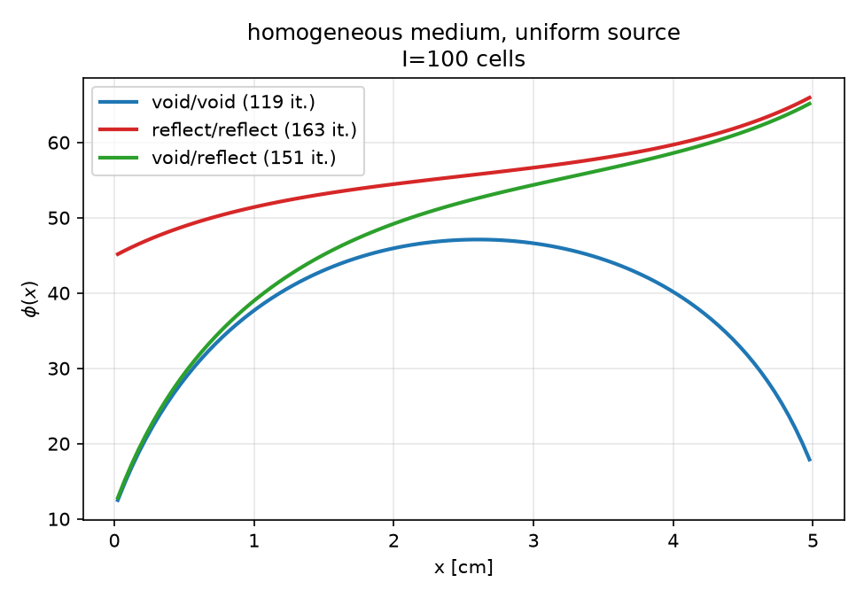
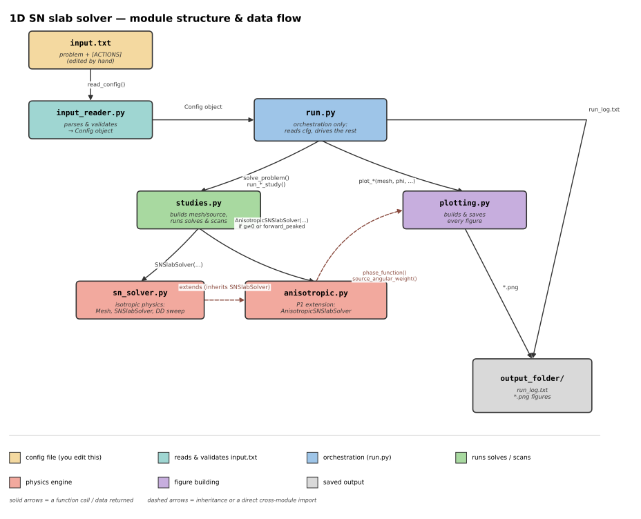

# Diamond Difference Equations and $S_N$ Transport Solver

## Table of Contents

1. [1-D Slab Geometry Transport Equation](#1-1-d-slab-geometry-transport-equation)
2. [Discretization of Angle and Space](#2-discretization-of-angle-and-space)
   - [2.1 Angular Discretization](#21-angular-discretization)
   - [2.2 Spatial Discretization](#22-spatial-discretization)
3. [Derivation of the Diamond-Difference Sweep](#3-derivation-of-the-diamond-difference-sweep)
4. [Uniform Sources](#4-uniform-sources)
   - [4.1 Uniformly Distributed Source](#41-uniformly-distributed-source)
   - [4.2 Forward-Peaked External Source](#42-forward-peaked-external-source)
5. [Anisotropic Sources](#5-anisotropic-sources)
   - [5.1 Linear Anisotropic](#51-linear-anisotropic)
   - [5.2 Forward-Peaked Source](#52-forward-peaked-source)
6. [Boundary Conditions](#6-boundary-conditions)
   - [6.1 Void Boundary Conditions](#61-void-boundary-conditions)
   - [6.2 Reflective Boundary Conditions](#62-reflective-boundary-conditions)
   - [6.3 Left Void and Right Reflective Boundary Conditions](#63-left-void-and-right-reflective-boundary-conditions)
7. [Non-Positivity Problem of Diamond Difference](#7-non-positivity-problem-of-diamond-difference-possible-negative-fluxes)
8. [Source Iteration Algorithm and Convergence Tolerance](#8-source-iteration-algorithm-and-convergence-tolerance)
9. [Code Implementation](#9-code-implementation)
10. [Results and Conclusions](#10-results-and-conclusions)
    - [10.1 Case 1 — Uniform Source with All BCs](#101-case-1--uniform-source-with-all-bcs)
    - [10.2 Case 2 — Analytical Verification (Reflect/Reflect)](#102-case-2--analytical-verification-reflectreflect)
    - [10.3 Case 3 — Peaked Source with All BCs](#103-case-3--peaked-source-with-all-bcs)
    - [10.3.b Case 3.b — Grid Convergence Study](#103b-case-3b--grid-convergence-study)
    - [10.4 Case 4 — Heterogeneous Material](#104-case-4--heterogeneous-material)
    - [10.5 Analysis of Iterations vs Scattering Ratio](#105-analysis-of-iterations-vs-scattering-ratio)
    - [10.6 Case 6 — Anisotropic Functions](#106-case-6--anisotropic-functions)
    - [10.7 Case 7 — Anisotropic Scattering + Forward-Peaked Source](#107-case-7--anisotropic-scattering--forward-peaked-source)
11. [Plot Files Reference](#11-plot-files-reference)
12. [How to Reproduce](#12-how-to-reproduce)

---

## 1. 1-D Slab Geometry Transport Equation

The equation is given as:

$$
\mu\frac{\partial\psi(x,\mu)}{\partial x}+\Sigma_{t}(x)\psi(x,\mu)=Q(x,\mu)
\tag{1}
$$

where:

- $x =$ spatial coordinate
- $\mu \in [-1,1] =$ direction cosine
- $\psi(x,\mu) =$ angular flux
- $\Sigma_{t}(x) =$ total macroscopic cross section
- $Q(x,\mu) =$ total source

The total source is split into external and scattering components:

$$
Q(x,\mu)=Q_{ext}(x,\mu)+Q_{s}(x,\mu)
$$

---

## 2. Discretization of Angle and Space

### 2.1. Angular Discretization

Instead of solving for every continuous $\mu \in [-1,1]$, we select $N$ discrete directions: $\mu_m$, $m=1,2,...,N$, so equation (1) becomes:

$$
\mu_m\frac{d\psi_m}{dx}+\Sigma_t(x)\psi_m(x)=Q_m(x)
\tag{2}
$$

where $\psi_m(x)=\psi(x,\mu_m)$.

### 2.2. Spatial Discretization

Suppose the slab has length $d$ and is divided into $I$ cells. The cell width is $h=\frac{d}{I}$ and cell $i$ occupies

$$
x_{i-\frac{1}{2}} \le x \le x_{i+\frac{1}{2}}.
$$

The cell center is

$$
x_i=\left(i-\frac{1}{2}\right)h.
$$

For each angle we have:

- At the left edge: $\psi_{m,i-\frac{1}{2}}$
- At the cell center: $\psi_{m,i}$
- At the right edge: $\psi_{m,i+\frac{1}{2}}$

The diamond-difference approximation says that the cell-center angular flux is the arithmetic average of the two edge fluxes:

$$
\psi_{m,i}=
\frac{
\psi_{m,i-\frac{1}{2}}+
\psi_{m,i+\frac{1}{2}}
}{2}
\tag{3}
$$

To derive the cell-integrated transport equation, assuming $\Sigma_t$ is constant within cell, from equation (2):

$$
\mu_m\frac{d\psi_m}{dx}+\Sigma_{t,i}\psi_m=Q_m
$$

Now, integrating equation (2):

$$
\int_{x_{i-\frac{1}{2}}}^{x_{i+\frac{1}{2}}}
\left[
\mu_m\frac{d\psi_m}{dx}
+\Sigma_{t,i}\psi_m
\right]dx
=
\int_{x_{i-\frac{1}{2}}}^{x_{i+\frac{1}{2}}}
Q_{m,i}\,dx
$$

**First term:**

$$
\int_{x_{i-\frac{1}{2}}}^{x_{i+\frac{1}{2}}}
\left[
\mu_m\frac{d\psi_m}{dx}
\right]dx
=
\mu_m
\left(
\psi_{i+\frac{1}{2},m}
-
\psi_{i-\frac{1}{2},m}
\right)
$$

**Second term:**

$$
\psi_{m,i}
=
\frac{1}{h_i}
\int_{x_{i-\frac{1}{2}}}^{x_{i+\frac{1}{2}}}
\psi_m(x)\,dx
$$

**Third term:**

$$
Q_{m,i}
=
\frac{1}{h_i}
\int_{x_{i-\frac{1}{2}}}^{x_{i+\frac{1}{2}}}
Q_m\,dx
$$

So we get:

$$
\mu_m
\left(
\psi_{i+\frac{1}{2},m}
-
\psi_{i-\frac{1}{2},m}
\right)
+
h_i\Sigma_{t,i}\psi_{i,m}
=
h_iQ_{i,m}
\tag{4}
$$

This is the cell-integrated discrete transport equation.

---

## 3. Derivation of the Diamond-Difference Sweep

For positive angular direction $\mu_m>0$, particles travel from left to right.

From equation (4):

$$
\mu_m
\left(
\psi_{i+\frac{1}{2},m}
-
\psi_{i-\frac{1}{2},m}
\right)
+
h_i\Sigma_{t,i}\psi_{i,m}
=
h_iQ_{i,m}
$$

Substitute equation (3) into the integrated transport equation:

$$
\mu_m
\left(
\psi_{i+\frac{1}{2},m}
-
\psi_{i-\frac{1}{2},m}
\right)
+
\frac{h_i\Sigma_{t,i}}{2}
\left(
\psi_{i-\frac{1}{2},m}
+
\psi_{i+\frac{1}{2},m}
\right)
=
h_iQ_{i,m}
$$

Re-arranging:

$$
\left(
\mu_m+\frac{h_i\Sigma_{t,i}}{2}
\right)
\psi_{i+\frac{1}{2},m}
=
\left(
\mu_m-\frac{h_i\Sigma_{t,i}}{2}
\right)
\psi_{i-\frac{1}{2},m}
+
h_iQ_{i,m}
$$

Multiply by 2:

$$
\left(
2\mu_m+h_i\Sigma_{t,i}
\right)
\psi_{i+\frac{1}{2},m}
=
\left(
2\mu_m-h_i\Sigma_{t,i}
\right)
\psi_{i-\frac{1}{2},m}
+
2h_iQ_{i,m}
$$

Therefore:

$$
\psi_{i+\frac{1}{2},m}
=
\frac{
2\mu_m-h_i\Sigma_{t,i}
}{
2\mu_m+h_i\Sigma_{t,i}
}
\psi_{i-\frac{1}{2},m}
+
\frac{
2h_i
}{
2\mu_m+h_i\Sigma_{t,i}
}
Q_{i,m}
$$

We define the **transmission coefficient** $A$ for cell $i$, and the **source coefficient** $B$ for cell $i$:

$$
A_{i,m}
=
\frac{
2\mu_m-h_i\Sigma_{t,i}
}{
2\mu_m+h_i\Sigma_{t,i}
}
$$

$$
B_{i,m}
=
\frac{
2h_i
}{
2\mu_m+h_i\Sigma_{t,i}
}
$$

Finally:

$$
\psi_{i+\frac{1}{2},m}
=
A_{i,m}\psi_{i-\frac{1}{2},m}
+
B_{i,m}Q_{i,m}
\tag{5}
$$

---

For negative angular direction $\mu_m<0$, particles travel from right to left ($\mu_m=-|\mu_m|$):

$$
-|\mu_m|
\left(
\psi_{i+\frac{1}{2},m}
-
\psi_{i-\frac{1}{2},m}
\right)
+
h_i\Sigma_{t,i}\psi_{i,m}
=
h_iQ_{i,m}
$$

Substitute equation (3) into the integrated transport equation:

$$
-|\mu_m|
\left(
\psi_{i+\frac{1}{2},m}
-
\psi_{i-\frac{1}{2},m}
\right)
+
\frac{h_i\Sigma_{t,i}}{2}
\left(
\psi_{i-\frac{1}{2},m}
+
\psi_{i+\frac{1}{2},m}
\right)
=
h_iQ_{i,m}
$$

Re-arranging:

$$
\left(
-|\mu_m|+\frac{h_i\Sigma_{t,i}}{2}
\right)
\psi_{i-\frac{1}{2},m}
=
\left(
-|\mu_m|-\frac{h_i\Sigma_{t,i}}{2}
\right)
\psi_{i+\frac{1}{2},m}
+
h_iQ_{i,m}
$$

Multiply by 2:

$$
\left(
-2|\mu_m|+h_i\Sigma_{t,i}
\right)
\psi_{i-\frac{1}{2},m}
=
\left(
-2|\mu_m|-h_i\Sigma_{t,i}
\right)
\psi_{i+\frac{1}{2},m}
+
2h_iQ_{i,m}
$$

Therefore:

$$
\psi_{i-\frac{1}{2},m}
=
\frac{
2|\mu_m|-h_i\Sigma_{t,i}
}{
2|\mu_m|+h_i\Sigma_{t,i}
}
\psi_{i+\frac{1}{2},m}
+
\frac{
2h_i
}{
2|\mu_m|+h_i\Sigma_{t,i}
}
Q_{i,m}
$$

Notice that this has exactly the same form as the positive-direction equation if we replace $\mu_m$ by $|\mu_m|$.

Again, defining:

$$
A_{i,m}
=
\frac{
2|\mu_m|-h_i\Sigma_{t,i}
}{
2|\mu_m|+h_i\Sigma_{t,i}
}
$$

$$
B_{i,m}
=
\frac{
2h_i
}{
2|\mu_m|+h_i\Sigma_{t,i}
}
$$

Finally:

$$
\psi_{i-\frac{1}{2},m}
=
A_{i,m}\psi_{i+\frac{1}{2},m}
+
B_{i,m}Q_{i,m}
$$

---

## 4. Uniform Sources

### 4.1. Uniformly Distributed Source

"Uniformly distributed" means that the source has the same value in every spatial cell. The length of slab is defined as:

$$
0 \le x \le d,
\qquad
d=5\text{ cm}
$$

External source:

$$
S_{ext}=10\text{ cm}^{-3}\text{s}^{-1}
$$

For isotropic emission, the angular source is:

$$
Q_{ext}(x,\mu)
=
\frac{S_{ext}(x)}{2}
=
5\text{ cm}^{-3}\text{s}^{-1},
\qquad
\text{for all }x\in[0,5]
\text{ and }\mu\in[-1,1]
$$

**Given Parameters:**

$$
\Sigma_t=2\text{ cm}^{-1},
\qquad
c=0.9
$$

**Scattering Cross Section:**

$$
\Sigma_s=c\Sigma_t=0.9(2)=1.8\text{ cm}^{-1}
$$

The isotropic scattering source is:

$$
Q_s(x)
=
\frac{\Sigma_s}{2}\phi_0(x)
=
\frac{1.8}{2}\phi_0(x)
=
0.9\phi_0(x)
$$

**Total Source:**

$$
Q(x,\mu)
=
Q_s(x)+Q_{ext}(x,\mu)
=
0.9\phi_0(x)+5
$$

**Source Strength Verification:**

$$
\int_0^5 S_{ext}(x)\,dx
=
\int_0^5 10\,dx
=
10[x]_0^5
=
10(5-0)
=
50\text{ cm}^{-3}\text{s}^{-1}
$$

### 4.2. Forward-Peaked External Source

For the peaked source with width $w=0.1\text{ cm}$:

$$
S_{peak}(x)
=
\begin{cases}
500, & \text{for }2.45\le x\le2.55\\
0, & \text{otherwise}
\end{cases}
$$

Because the source is isotropic (emits equally in all directions):

$$
Q_{ext}(x,\mu)
=
\frac{S_{peak}(x)}{2}
=
\frac{500}{2}
=
250
$$

**Given Parameters:**

$$
\Sigma_t=2\text{ cm}^{-1},
\qquad
c=0.9
$$

$$
\Sigma_s=c\Sigma_t=1.8\text{ cm}^{-1}
$$

$$
Q_s(x)=0.9\phi_0(x)
$$

**Total Source:**

$$
Q(x,\mu)
=
Q_s(x)+Q_{ext}(x,\mu)
=
0.9\phi_0(x)+250
$$

**Source Strength Verification:**

$$
\int S_{peak}(x)\,dx
=
500(2.55-2.45)
=
500(0.1)
=
50\text{ cm}^{-3}\text{s}^{-1}
$$

The total source strength is preserved:

$$
50\text{ cm}^{-3}\text{s}^{-1}
$$

---

## 5. Anisotropic Sources

### 5.1. Linear Anisotropic

Linear anisotropic scattering with $g=0.2$, where $g$ is the anisotropy parameter (average cosine of the scattering angle):

- $g=0$: isotropic scattering
- $g>0$: preferentially forward scattering
- $g<0$: preferentially backward scattering
- $g=0.2$: mildly forward-peaked scattering

The scattering source with anisotropic scattering kernel:

$$
Q_s(\mu)
=
\Sigma_s
\int_{-1}^{1}
\frac{1}{2}
\left(
1+3g\mu\mu'
\right)
\psi(\mu')\,d\mu'
$$

Expanding the integrand:

$$
Q_s(\mu)
=
\frac{\Sigma_s}{2}
\int_{-1}^{1}
\psi(\mu')\,d\mu'
+
\frac{3g\Sigma_s}{2}\mu
\int_{-1}^{1}
\mu'\psi(\mu')\,d\mu'
$$

- The zeroth angular moment is the scalar flux:

$$
\phi_0
=
\int_{-1}^{1}
\psi(\mu')\,d\mu'
$$

- The first angular moment is related to the current:

$$
\phi_1
=
\int_{-1}^{1}
\mu'\psi(\mu')\,d\mu'
$$

Therefore:

$$
Q_s(\mu)
=
\frac{\Sigma_s}{2}\phi_0
+
\frac{3g\Sigma_s}{2}\mu\phi_1
$$

For $\Sigma_s=1.8\text{ cm}^{-1}$ and $g=0.2$:

$$
Q_s(\mu)
=
\frac{1.8}{2}\phi_0
+
\frac{3(0.2)(1.8)}{2}\mu\phi_1
=
0.9\phi_0
+
0.54\mu\phi_1
$$

### 5.2. Forward-Peaked Source

The specified source is:

$$
S_{ext}(\mu)
=
10\left(\frac{1+\mu}{2}\right)
\implies
S_{ext}(\mu)=5(1+\mu)
$$

- At $\mu=-1$ (backward direction):

$$
S_{ext}(-1)=5(1-1)=0
$$

- At $\mu=0$ (perpendicular direction):

$$
S_{ext}(0)=5(1+0)=5
$$

- At $\mu=1$ (forward direction):

$$
S_{ext}(1)=5(1+1)=10
$$

External source for each direction:

$$
Q_{ext,m}=5(1+\mu_m)
$$

Total source:

$$
Q_{i,m}
=
5(1+\mu_m)
+
\frac{1}{2}\Sigma_{s,0,i}\phi_{0,i}
+
\frac{3}{2}\Sigma_{s,1,i}\mu_m\phi_{1,i}
$$

Given $c=0.9$ and $\Sigma_t=2.0\text{ cm}^{-1}$:

$$
\Sigma_{s,0}
=
c\Sigma_t
=
1.80\text{ cm}^{-1}
$$

$$
\Sigma_{s,1}
=
g\Sigma_{s,0}
=
0.2(1.80)
=
0.36\text{ cm}^{-1}
$$

The complete source used by the diamond-difference sweep is:

$$
Q(\mu)
=
5(1+\mu)
+
0.9\phi_0
+
0.54\mu\phi_1
$$

---

## 6. Boundary Conditions

### 6.1. Void Boundary Conditions

Only outgoing particles are allowed at void boundaries.

- **Left Boundary ($x=0$):** No incoming flux from left:

$$
\psi(0,\mu>0)=0
$$

Discrete form:

$$
\psi_{i-\frac{1}{2},m}=0
\qquad
\text{for }\mu_m>0
$$

- **Right Boundary ($x=d$):** No incoming flux from right:

$$
\psi(d,\mu<0)=0
$$

Discrete form:

$$
\psi_{i+\frac{1}{2},m}=0
\qquad
\text{for }\mu_m<0
$$

### 6.2. Reflective Boundary Conditions

- **Left Boundary ($x=0$):** Particles traveling in positive direction are reflected from negative direction:

$$
\psi(0,\mu>0)=\psi(0,-\mu)
$$

Discrete form:

$$
\psi_{i-\frac{1}{2},m}
=
\psi_{i-\frac{1}{2},m'}
\qquad
\text{for }\mu_m>0
$$

where $\mu_{m'}=-\mu_m$.

- **Right Boundary ($x=d$):** Particles traveling in negative direction are reflected from positive direction:

$$
\psi(d,\mu<0)=\psi(d,-\mu)
$$

### 6.3. Left Void and Right Reflective Boundary Conditions

- **Left Boundary ($x=0$):** Void boundary:

$$
\psi(0,\mu>0)=0
$$

- **Right Boundary ($x=d$):** Reflective boundary:

$$
\psi(d,\mu<0)=\psi(d,-\mu)
$$

---

## 7. Non-Positivity Problem of Diamond Difference (Possible Negative Fluxes)

For either sweep direction:

$$
A_{i,m}
=
\frac{
2|\mu_m|-h_i\Sigma_{t,i}
}{
2|\mu_m|+h_i\Sigma_{t,i}
}
$$

The denominator is positive:

$$
2|\mu_m|+h_i\Sigma_{t,i}>0
$$

Therefore, $A_{i,m}<0$ when:

$$
2|\mu_m|-h_i\Sigma_{t,i}<0
$$

which gives:

$$
h_i\Sigma_{t,i}>2|\mu_m|
$$

Defining the cell optical thickness

$$
\tau_i=h_i\Sigma_{t,i}
$$

non-positivity occurs when:

$$
\tau_i>2|\mu_m|
$$

When $A_{i,m}<0$, non-positivity can occur. Physically, outgoing flux is related to incoming flux as:

$$
\psi_{out}
=
A_i\psi_{in}
+
B_iQ_{m,i}
$$

Therefore, when $A_{i,m}<0$, the outgoing flux can become negative if:

$$
B_iQ_{m,i}<|A_i|\psi_{in}
$$

---

## 8. Source Iteration Algorithm and Convergence Tolerance

Before starting the iteration process, we set the initial scalar flux to zero everywhere in the slab:

$$
\phi^{(0)}=0
$$

The main iteration loop continues until convergence is achieved or the maximum number of iterations is reached.

For each cell and each angular direction $m$:

**a. Compute total source:**

$$
Q_{m,i}^{(k)}
=
Q_{ext,m}
+
\Sigma_s\phi_i^{(k)}
$$

**b.** Perform forward sweep ($\mu_m>0$).

**c.** Perform backward sweep ($\mu_m<0$).

**d. Compute scalar flux:**

$$
\phi_i^{(k+1)}
=
\sum_m w_m\psi_{m,i}^{(k+1)}
$$

**e. Check convergence:**

$$
\epsilon^{(k)}
=
\frac{
\left\|
\phi^{(k+1)}-\phi^{(k)}
\right\|_{\infty}
}{
\left\|
\phi^{(k+1)}
\right\|_{\infty}
}
$$

**f.** If $\epsilon^{(k)}<\text{tol}$, stop, where:

$$
\text{tol}=10^{-8}
$$

**g. Update:**

$$
\phi^{(k)}
=
\phi^{(k+1)}
$$

---

## 9. Code Implementation

The program reads and validates the input parameters, runs the main $S_N$ transport solver, performs parameter studies and visualization, and finally stores the numerical results, figures, and convergence data in the `es7/` directory.

---

## 10. Results and Conclusions

### 10.1. Case 1 — Uniform Source with All BCs

The graph displays scalar flux vs. position for all three boundary conditions on a single plot:

- **Void/Void Boundary Conditions:** Particles leak out at both boundaries, flux is maximum at the center and the shape is symmetric (parabolic). This is the classic diffusion profile for a uniform source in a slab with vacuum boundaries.
- **Reflect/Reflect Boundary Conditions:** No particles escape (reflective boundaries), flux is constant throughout the slab ($\phi(x)=50.0$ everywhere). This represents an infinite homogeneous medium with no leakage.
- **Void/Reflect Boundary Conditions:** Left boundary is void (particles escape) and right boundary is reflective (particles reflect back), so the flux distribution is asymmetric.



### 10.2. Case 2 — Analytical Verification (Reflect/Reflect)

For a uniform source with reflective BCs, the source generates particles uniformly. Reflective boundaries prevent particles from escaping until equilibrium is reached.



### 10.3. Case 3 — Peaked Source with All BCs

- **Void/Void:** The peaked source is concentrated at $x=2.5$ (width $0.1$ cm), so particles are generated only in this narrow region. They scatter outward, decaying with distance. Void boundaries allow particles to escape, so the flux is low at the edges. Fastest convergence as particles escape at both ends.
- **Reflect/Reflect:** Reflective boundaries trap particles, so particles scatter multiple times before being absorbed. Flux remains high even far from the source. The peak is broadened by reflections. Slowest convergence as no particle escape.
- **Void/Reflect:** The left boundary leaks, so the flux is low on the left, while the right boundary reflects, so the flux is high on the right and an asymmetric profile is produced. Intermediate convergence.

This demonstrates that the spectral radius of source iteration depends on boundary conditions. The more reflective the boundaries, the slower the convergence.



### 10.3.b. Case 3.b — Grid Convergence Study

**Left Panel: Minimum Edge Flux vs. Mesh Refinement**

Diamond difference is not positivity-preserving. For coarse meshes ($I<5$), the optical thickness

$$
\tau=h\Sigma_t>2|\mu_{\min}|
$$

This leads to negative edge fluxes (non-physical). As the mesh is refined, $\tau$ decreases and fluxes become positive. The curve crosses zero between $I=4$ and $I=5$.

**Right Panel: Scalar Flux Convergence**

As the mesh is refined, the peak height increases because the sharp gradient is better resolved. The solution converges for $I\ge50$. Grid independence is achieved at approximately $I=100$.



### 10.4. Case 4 — Heterogeneous Material

- **Void/Void:** There is a discontinuity at $x=2.5$, with a maximum in the right half where $c=0.99$ (high scattering). Particles are trapped, while in the left half ($c=0.5$, low scattering), particles escape more easily. The right half has a higher flux due to stronger scattering.
- **Reflect/Reflect:** Reflective boundaries prevent leakage. Very high flux is observed in the right half due to strong scattering ($c=0.99$) and particle trapping. The left half has moderate scattering ($c=0.5$), but no escape due to the reflective boundary, so the flux is lower.
- **Void/Reflect:** Similar to the Reflect/Reflect case, but with lower flux on the left due to leakage and higher flux on the right due to the reflective boundary.



### 10.5. Analysis of Iterations vs. Scattering Ratio $c$

The iteration count increases with the scattering ratio $c$ for all three boundary conditions:

- **Reflect/Reflect (RR)** requires the most iterations.
- **Void/Reflect (VR)** requires intermediate iterations.
- **Void/Void (VV)** requires the least iterations.



### 10.6. Case 6 — Anisotropic Functions

$p(\mu_0)$ is the probability of scattering into angle $\mu_0$. In this case, forward scattering ($\mu_0>0$) is enhanced and backward scattering ($\mu_0<0$) is suppressed.

For the isotropic reference ($g=0$), $p=0.5$ everywhere. For $g=0.2$, the distribution is mildly forward-peaked.

At $\mu_0=1$ (forward):

$$
p=0.8
$$

At $\mu_0=-1$ (backward):

$$
p=0.2
$$

The curve is linear because a $P_1$ (linear anisotropic) expansion is used.




### 10.7. Case 7 — Anisotropic Scattering + Forward-Peaked Source

- **Void/Void:** Anisotropic scattering enhances forward transport and produces a slightly higher peak due to the forward-peaked source. Faster convergence is observed due to more directional streaming.
- **Reflect/Reflect:** Anisotropic scattering plus a forward-peaked source leads to more forward streaming. Reflective boundaries trap particles and higher buildup is observed. Flux is not perfectly constant (small variation).
- **Void/Reflect:** Similar to RR but with leakage on the left. Anisotropic effects enhance forward transport.





---

## 11. Plot Files Reference

| Case | Folder | Files |
| --- | --- | --- |
| 1 | `es7/Case1_Uniform_AllBCs/` | `solution.png` |
| 2 | `es7/Case2_Analytical_Verification/` | `solution.png` |
| 3 | `es7/Case3_Peaked_AllBCs/` | `solution.png`, `grid_convergence.png` |
| 4 | `es7/Case4_Heterogeneous/` | `solution.png` |
| 5 | `es7/Case5_Iterations_vs_c/` | `iterations_vs_c.png` |
| 6 | `es7/Case6_Anisotropic_Functions/` | `solution.png`, `anisotropic_functions.png` |
| 7 | `es7/Case7_Anisotropic_ForwardPeaked/` | `solution.png`, `anisotropic_functions.png` |

---

## 12. Solver

The solver architecture is designed to be user-friendly, allowing even users with no prior knowledge of programming or physics to solve a case by simply providing the required numerical parameters in a text file.



To run a test case, first define the required parameters in `input.txt` and then run the solver:

```bash
# Define the test case
input.txt

# Basic run
python3 run.py
```

Alternatively, the same checks can be run through an interactive Tkinter GUI (`gui_app_sn_slab.py`), which lets you pick and adjust the same parameters from a graphical interface and see the resulting plots immediately, without editing `input.txt` by hand:

```
python gui_app_sn_slab.py
```
