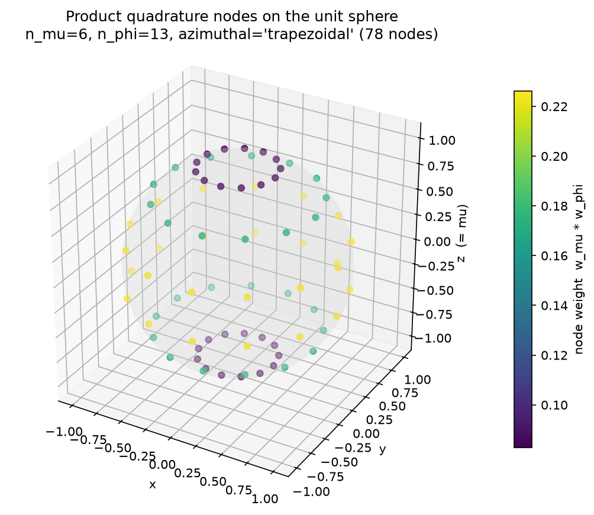
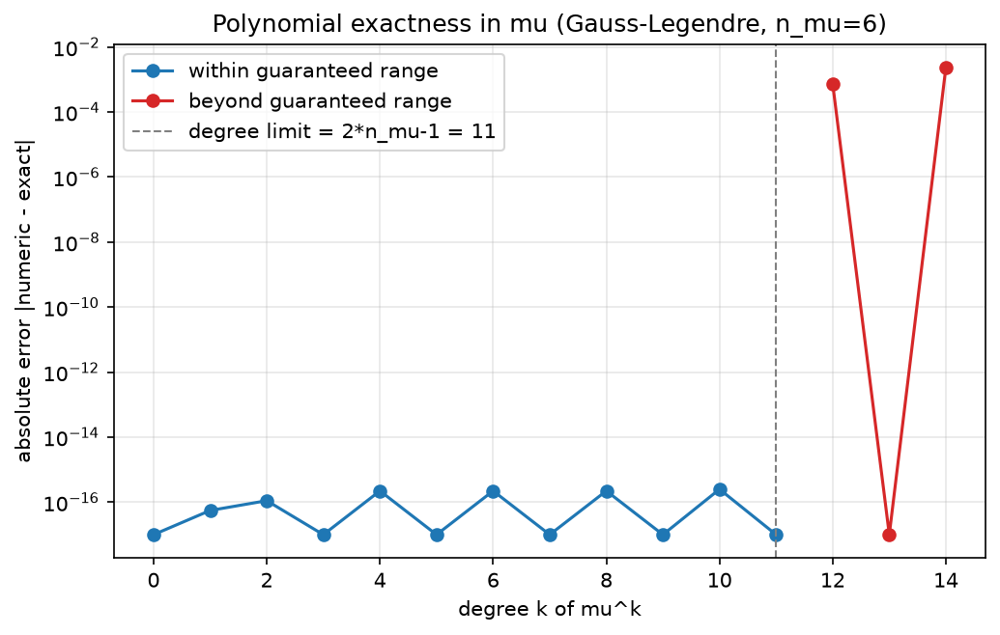
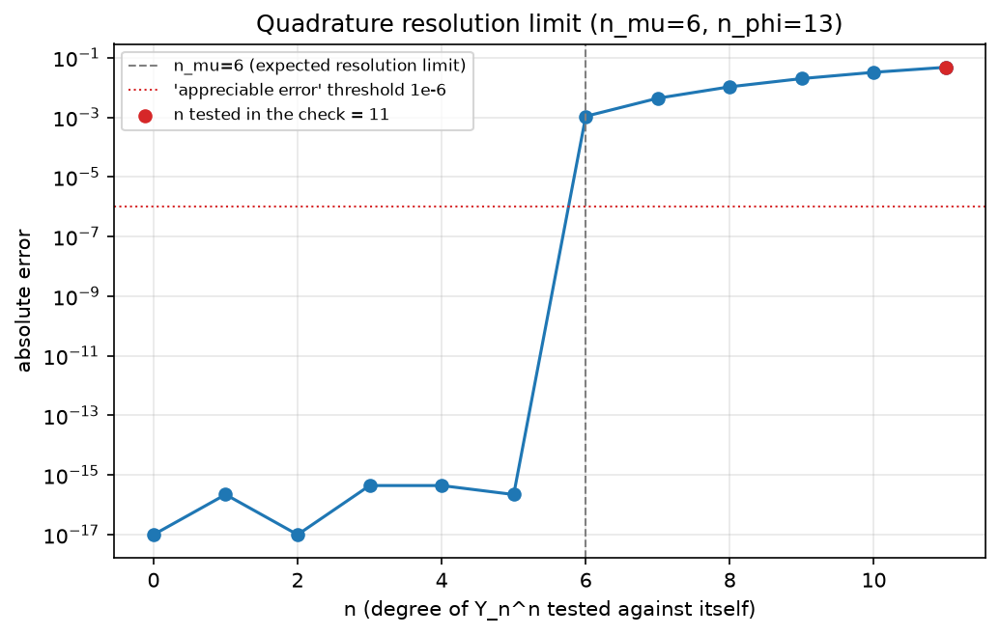
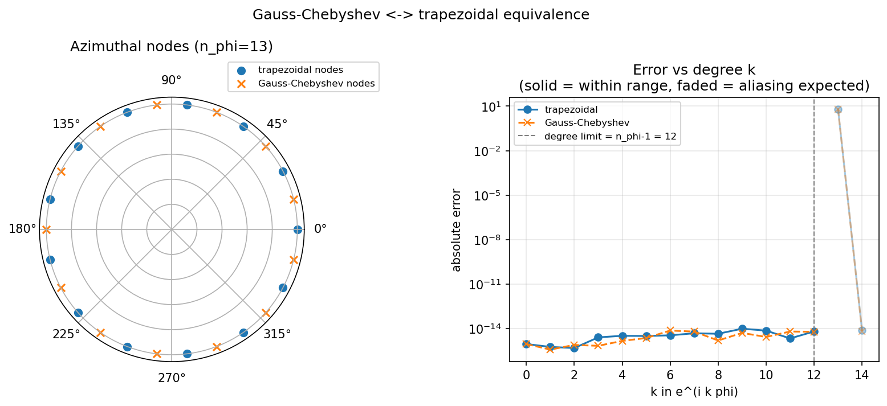
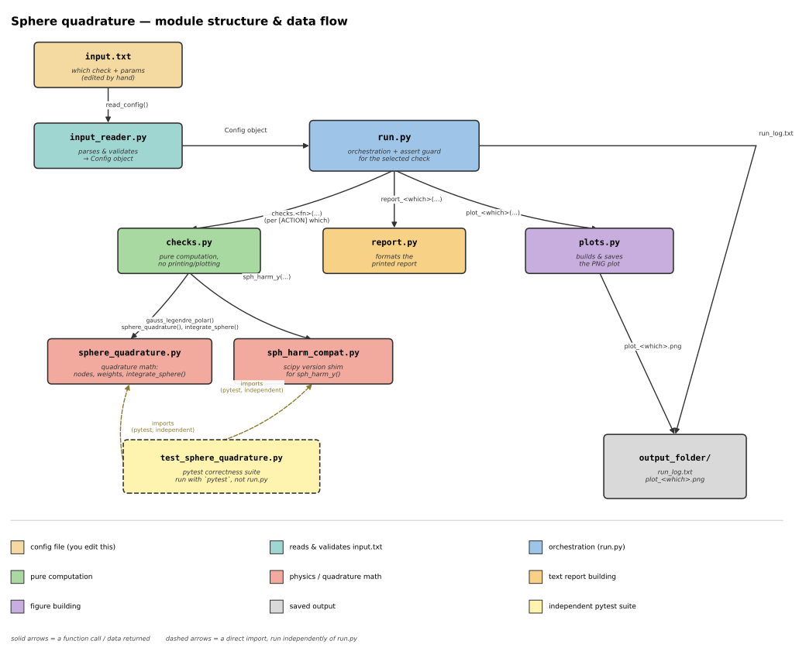

# Gauss–Legendre Quadrature on the Unit Sphere

## Table of Contents

- [1. Objective](#1-objective)
- [2. Spherical Coordinates](#2-spherical-coordinates)
- [3. Transformation to $\mu=\cos\theta$](#3-transformation-to-mu-costheta)
- [4. Gauss–Legendre Quadrature in $\mu$](#4-gausslegendre-quadrature-in-mu)
- [5. Periodic Trapezoidal Rule in $\phi$](#5-periodic-trapezoidal-rule-in-phi)
- [6. Product Quadrature Rule](#6-product-quadrature-rule)
- [7. Quadrature Points on the Sphere](#7-quadrature-points-on-the-sphere)
- [8. Spherical Harmonics](#8-spherical-harmonics)
- [9. Resolution Requirement](#9-resolution-requirement)
- [10. Constant Function Test](#10-constant-function-test)
- [11. Algorithm](#11-algorithm)
- [12. Results](#12-results)
- [13. Solver](#13-Solver)

---

## 1. Objective

The goal is to construct a numerical quadrature rule for integrating functions over the unit sphere using a product quadrature rule consisting of:

- **Gauss–Legendre quadrature** in the variable $\mu=\cos\theta$
- **Periodic trapezoidal quadrature** in the azimuthal variable $\phi$

---

## 2. Spherical Coordinates

A point on the unit sphere is parameterized by

$$
\mathbf r(\theta,\phi) = (\sin\theta\cos\phi,\ \sin\theta\sin\phi,\ \cos\theta),
$$

with

$$
0\leq\theta\leq\pi, \qquad 0\leq\phi<2\pi.
$$

The surface element is

$$
d\Omega=\sin\theta\,d\theta\,d\phi.
$$

Therefore,

$$
\int_{S^2} f\,d\Omega = \int_0^\pi \int_0^{2\pi} f(\theta,\phi)\sin\theta\,d\phi\,d\theta.
$$

---

## 3. Transformation to $\mu=\cos\theta$

Introduce

$$
\mu=\cos\theta.
$$

Then

$$
d\mu=-\sin\theta\,d\theta,
$$

and the limits become

$$
\theta=0\Rightarrow\mu=1, \qquad \theta=\pi\Rightarrow\mu=-1.
$$

Hence,

$$
\int_0^\pi f(\theta)\sin\theta\,d\theta = \int_{-1}^{1} f(\mu)\,d\mu.
$$

Thus,

$$
\boxed{
\int_{S^2} f\,d\Omega
= \int_{-1}^{1} \int_0^{2\pi} f(\mu,\phi)\,d\phi\,d\mu
}.
$$

---

## 4. Gauss–Legendre Quadrature in $\mu$

An $N_\mu$-point Gauss–Legendre rule is

$$
\int_{-1}^{1} g(\mu)\,d\mu \approx \sum_{i=1}^{N_\mu} w_i^\mu g(\mu_i).
$$

The points are the roots of

$$
P_{N_\mu}(\mu_i)=0,
$$

with weights

$$
w_i^\mu = \frac{2}{(1-\mu_i^2)\left[P'_{N_\mu}(\mu_i)\right]^2}.
$$

The rule integrates polynomials exactly through degree

$$
\boxed{2N_\mu-1}.
$$

---

## 5. Periodic Trapezoidal Rule in $\phi$

Choose $N_\phi$ equally spaced points

$$
\phi_j=\frac{2\pi j}{N_\phi}, \qquad j=0,\ldots,N_\phi-1.
$$

The weights are

$$
w_j^\phi=\frac{2\pi}{N_\phi}.
$$

Therefore,

$$
\int_0^{2\pi} h(\phi)\,d\phi \approx \sum_{j=0}^{N_\phi-1} w_j^\phi h(\phi_j).
$$

---

## 6. Product Quadrature Rule

Combining both rules gives

$$
\boxed{
Q[f] = \sum_{i=1}^{N_\mu} \sum_{j=0}^{N_\phi-1} w_i^\mu w_j^\phi f(\mu_i,\phi_j)
}.
$$

Equivalently,

$$
Q[f] = \frac{2\pi}{N_\phi} \sum_{i=1}^{N_\mu} w_i^\mu \sum_{j=0}^{N_\phi-1} f(\mu_i,\phi_j).
$$

---

## 7. Quadrature Points on the Sphere

Each pair $(\mu_i,\phi_j)$ corresponds to

$$
x_{ij}=\sqrt{1-\mu_i^2}\cos\phi_j,
$$

$$
y_{ij}=\sqrt{1-\mu_i^2}\sin\phi_j,
$$

$$
z_{ij}=\mu_i.
$$

Hence,

$$
\boxed{
\mathbf r_{ij} = \left( \sqrt{1-\mu_i^2}\cos\phi_j, \sqrt{1-\mu_i^2}\sin\phi_j, \mu_i \right)
}.
$$

The product weight is

$$
\boxed{W_{ij}=w_i^\mu w_j^\phi}.
$$

---

## 8. Spherical Harmonics

The complex spherical harmonics are written as

$$
Y_\ell^m(\mu,\phi) = \Omega_{\ell m} P_\ell^m(\mu) e^{im\phi},
$$

where

$$
\Omega_{\ell m} = \sqrt{ \frac{2\ell+1}{4\pi} \frac{(\ell-m)!}{(\ell+m)!} }.
$$

The indices satisfy

$$
\ell=0,1,2,\ldots, \qquad -\ell\leq m\leq\ell.
$$

For the standard normalization,

$$
\int_{S^2} Y_\ell^{m*} Y_{\ell'}^{m'}\,d\Omega = \delta_{\ell\ell'}\delta_{mm'}.
$$

---

## 9. Resolution Requirement

A sufficient resolution for spherical-harmonic orthogonality up to degree $L$ is

$$
\boxed{N_\mu \geq L+1}, \qquad \boxed{N_\phi \geq 2L+1}.
$$

The Gauss–Legendre rule with $N_\mu$ points integrates polynomials through degree

$$
2N_\mu - 1.
$$

Therefore, choosing

$$
N_\mu \geq L+1
$$

is sufficient to integrate the required polar polynomial products.

For the azimuthal direction, the spherical harmonics contain Fourier modes

$$
e^{im\phi}.
$$

Choosing

$$
N_\phi \geq 2L+1
$$

provides sufficient resolution for products of spherical harmonics up to degree $L$.

---

## 10. Constant Function Test

The exact area of the unit sphere is

$$
\int_{S^2} 1\,d\Omega = 4\pi.
$$

For the quadrature,

$$
Q[1] = \left( \sum_{i=1}^{N_\mu} w_i^\mu \right) \left( \sum_{j=0}^{N_\phi-1} w_j^\phi \right).
$$

Gauss–Legendre gives

$$
\sum_i w_i^\mu = 2,
$$

and the trapezoidal rule gives

$$
\sum_j w_j^\phi = 2\pi.
$$

Therefore,

$$
Q[1] = 2(2\pi) = 4\pi.
$$

This confirms that the quadrature correctly integrates a constant function over the sphere.

---

## 11. Algorithm

### Input

| Parameter | Description |
| --- | --- |
|  | Number of Gauss–Legendre nodes in $\mu$ |
|  | Number of equally spaced nodes in $\phi$ |
| `tolerance` | Convergence tolerance for Newton's method |

### Output

| Quantity | Description |
| --- | --- |
|  | Gauss–Legendre nodes and weights |
|  | Trapezoidal nodes and weights |
|  | Quadrature points on $S^2$ |
|  | Product quadrature weights |

### Step 1: Compute Gauss–Legendre Nodes and Weights

For each $i=1,\ldots,N_\mu$, compute the initial Newton guess

$$
\mu_i^{(0)} = \cos\left( \pi \frac{i - 1/4}{N_\mu + 1/2} \right).
$$

Evaluate the Legendre polynomial using the recurrence

$$
(k+1)P_{k+1}(\mu) = (2k+1)\mu P_k(\mu) - k P_{k-1}(\mu),
$$

with

$$
P_0(\mu)=1, \qquad P_1(\mu)=\mu.
$$

The derivative is

$$
P'_{N_\mu}(\mu) = \frac{N_\mu}{\mu^2 - 1} \left[ \mu P_{N_\mu}(\mu) - P_{N_\mu-1}(\mu) \right].
$$

Newton's method is

$$
\mu^{(k+1)} = \mu^{(k)} - \frac{P_{N_\mu}(\mu^{(k)})}{P'_{N_\mu}(\mu^{(k)})}.
$$

Continue until

$$
|\mu^{(k+1)} - \mu^{(k)}| < \text{tolerance}.
$$

After convergence, calculate the weight

$$
w_i^\mu = \frac{2}{(1-\mu_i^2)\left[P'_{N_\mu}(\mu_i)\right]^2}.
$$

### Step 2: Compute Trapezoidal Nodes and Weights

For

$$
j=0,\ldots,N_\phi-1,
$$

compute

$$
\phi_j = \frac{2\pi j}{N_\phi},
$$

and

$$
w_j^\phi = \frac{2\pi}{N_\phi}.
$$

### Step 3: Construct Quadrature Points on the Sphere

For each $i$, calculate

$$
\rho_i = \sqrt{1-\mu_i^2}.
$$

Then, for each $j$,

$$
x_{ij} = \rho_i \cos\phi_j,
$$

$$
y_{ij} = \rho_i \sin\phi_j,
$$

$$
z_{ij} = \mu_i.
$$

Store

$$
\mathbf r_{ij} = (x_{ij}, y_{ij}, z_{ij}).
$$

### Step 4: Compute Product Weights

For each $i,j$,

$$
W_{ij} = w_i^\mu w_j^\phi.
$$

Since the azimuthal weights are equal,

$$
W_{ij} = w_i^\mu \frac{2\pi}{N_\phi}.
$$

### Step 5: Apply Quadrature Rule

For a function $f(\mu,\phi)$, calculate

$$
Q[f] = \sum_{i=1}^{N_\mu} \sum_{j=0}^{N_\phi-1} W_{ij} f(\mu_i,\phi_j).
$$

Equivalently,

$$
Q[f] = \frac{2\pi}{N_\phi} \sum_{i=1}^{N_\mu} w_i^\mu \sum_{j=0}^{N_\phi-1} f(\mu_i,\phi_j).
$$

---

## 12. Results

All four checks were run with $N_\mu = 6$ and $N_\phi = 13$. Each figure below corresponds to one demonstration case, presented in the same order as the assignment requirements.

### 12.1 Product Quadrature Nodes on the Unit Sphere

The 3-D visualization shows all $6 \times 13 = 78$ product quadrature nodes placed exactly on the unit sphere, colored by their product weight $W_{ij} = w_i^\mu w_j^\phi$. The nodes cluster more densely near the poles (as expected from Gauss–Legendre) and are uniformly spaced in the azimuthal direction. The sum of all weights equals $4\pi \approx 12.566371$ with error $\sim 10^{-15}$, confirming the constant-function test.



**Figure 1:** Product quadrature nodes on the unit sphere ($N_\mu = 6$, $N_\phi = 13$, trapezoidal).

### 12.2 Polynomial Exactness in $\mu$ (Gauss–Legendre)

The plot shows the absolute error in integrating $\mu^k$ for $k = 0,\ldots,14$ with $N_\mu = 6$. Within the guaranteed range $k \leq 2N_\mu - 1 = 11$ (blue curve), errors sit at machine precision ($\sim 10^{-16}$), demonstrating exactness. Beyond $k = 11$ (red curve), errors jump to $\sim 10^{-3}$–$10^{-2}$, confirming that the rule fails past the theoretical degree limit (dashed vertical line).



**Figure 2:** Gauss–Legendre polynomial exactness in $\mu$ ($N_\mu = 6$).

### 12.3 Resolution Limit for Spherical Harmonics

This plot sweeps the diagonal self-overlap $\int |Y_n^n|^2\,d\Omega$ for $n = 0,\ldots,11$ using $N_\mu = 6$, $N_\phi = 13$. Machine-precision exactness holds for $n \leq 5 = N_\mu - 1$; the error jumps at $n = 6 = N_\mu$ (dashed line) to $\sim 10^{-3}$ and grows to $\sim 5 \times 10^{-2}$ at $n = 11$ (red point). This confirms the resolution condition $N_\mu \geq L + 1$ and demonstrates the predicted failure beyond it.



**Figure 3:** Resolution limit for spherical harmonics ($N_\mu = 6$, $N_\phi = 13$).

### 12.4 Gauss–Chebyshev ↔ Trapezoidal Equivalence (Bonus)

The left polar plot shows the two azimuthal node sets for $N_\phi = 13$: trapezoidal nodes (blue dots) and Gauss–Chebyshev nodes (orange crosses), which sit exactly halfway between the trapezoidal nodes (constant shift $\pi / N_\phi \approx 0.241661$). The right plot shows both rules integrate $e^{ik\phi}$ to machine precision for $k \leq 12 = N_\phi - 1$; at $k = 13 = N_\phi$ both fail with equal magnitude $|2\pi| \approx 6.283$ but opposite signs ($+6.283$ vs. $-6.283$), confirming the aliasing sign factor $(-1)^j$. This numerically verifies the mathematical equivalence between the two azimuthal rules.



**Figure 4:** Gauss–Chebyshev ↔ trapezoidal equivalence ($N_\phi = 13$).

---

## 13 Solver

The solver architecture is designed to be user-friendly, allowing even users with no prior knowledge of programming or physics to solve a case by simply providing the required numerical parameters in a text file.



To run a test case, first define the required parameters in `input.txt` and then run the solver:

```bash
# Define the test case
input.txt

# Basic run
python3 run.py
```

Alternatively, the same checks can be run through an interactive Tkinter GUI (`gui_app.py`), which lets you pick and adjust the same parameters from a graphical interface and see the resulting plots immediately, without editing `input.txt` by hand:

```
python gui_app.py
```